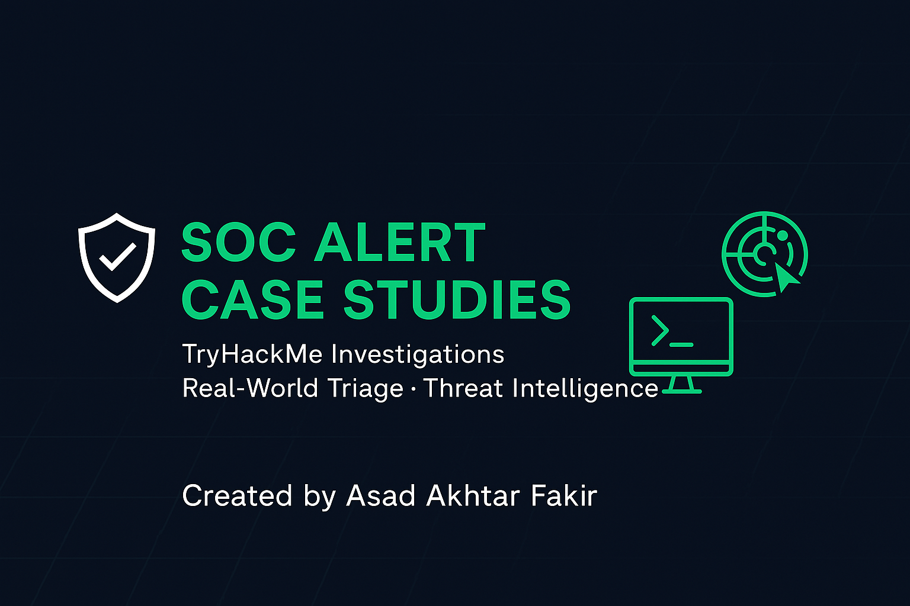

# soc-alert-case-studies

A collection of phishing and firewall alert investigations conducted in TryHackMe simulations and lab environments.  
Demonstrates alert triage, IOAs, threat intelligence, and documentation workflow with documented triage steps.
